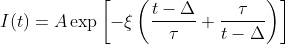
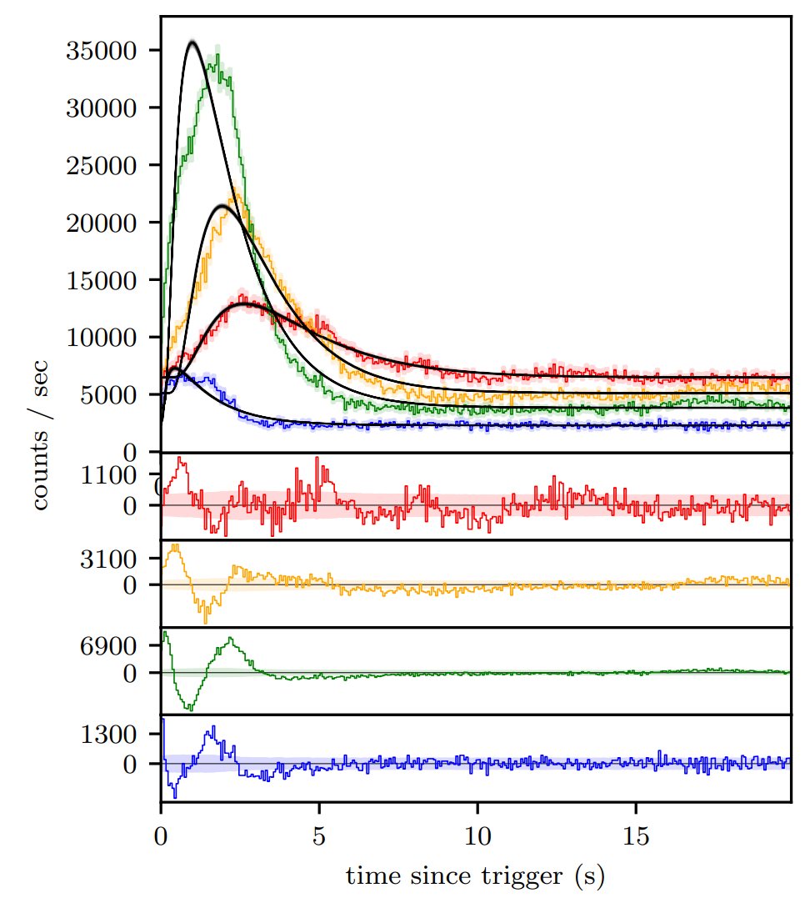

|Travis| |Coverage| |Docs| |AstroPy| 

=====
PyGRB
=====
.. inclusion-marker-one-liner-start
A GRB light-curve analysis package.

.. inclusion-marker-one-liner-end

.. inclusion-marker-what-it-does-start
What it does
-------------
Code to download GRB light-curves from internet archives (at the moment only BATSE implemented). The code is then able to create light-curves from either pre-binned data or time-tagged photon-event data. Light-curves may then be fitted with with pulse models, and further analysed.

.. inclusion-marker-what-it-does-end

.. inclusion-marker-pulse-types-start

Pulse types
------------
Description of GRB pulse phenomenology.

.. inclusion-marker-pulse-types-end

.. inclusion-marker-usage-start

Usage
------
Instructions on how to use the code.

.. inclusion-marker-usage-end

Coverage
--------

.. figure:: https://codecov.io/gh/JamesPaynter/PyGRB/branch/master/graphs/sunburst.svg
    :width: 20%
    :align: center
    :alt: Codecov Sunburst

.. |AstroPy| image:: http://img.shields.io/badge/powered%20by-AstroPy-orange.svg?style=flat
    :target: http://www.astropy.org/
    :alt: astropy
    
.. |Travis| image:: https://travis-ci.com/JamesPaynter/PyGRB.svg?branch=master
  :alt: Travis Badge
  :target: https://travis-ci.com/JamesPaynter/PyGRB
    
.. |Coverage| image:: https://codecov.io/gh/JamesPaynter/PyGRB/branch/master/graph/badge.svg
    :target: https://codecov.io/gh/JamesPaynter/PyGRB
    :alt: CodeCov - Coverage Status
    
.. |Docs| image:: https://readthedocs.org/projects/pygrb/badge/?version=latest
    :target: https://pygrb.readthedocs.io/en/latest/?badge=latest
    :alt: Documentation Status
